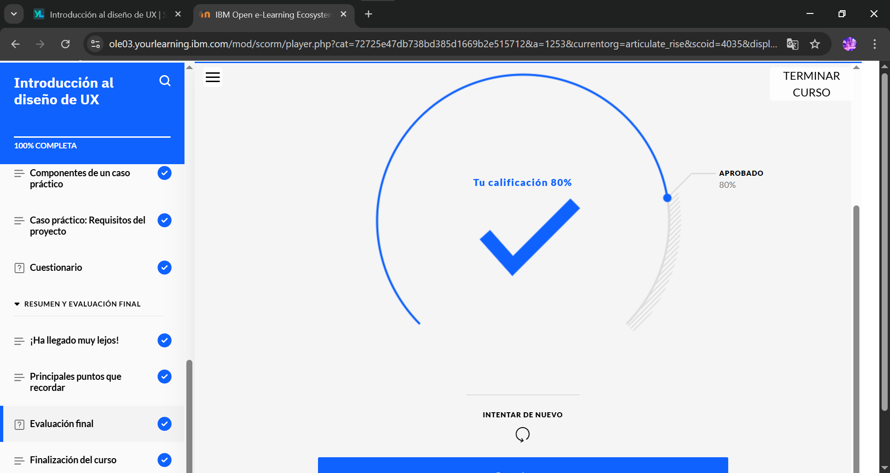

# Introducción al Diseño de UX

En este curso, obtendrá una descripción general del diseño de experiencias de usuario (UX). Conocerá algunas de las cualidades esenciales que se necesitan para destacar como diseñador de UX. Descubrirá el diseño centrado en el usuario (UCD), formas de diseñar para la diversidad y la importancia de los diseños adaptativos y reactivos en el diseño de UX. También conocerá un caso práctico de diseño de UX, incluidos sus componentes y el proceso paso a paso para crearlo. Por último, revisará un ejemplo de caso práctico de diseño de UX que define los requisitos del proyecto para un sitio web de comercio electrónico de venta de plantas.

## Objetivos del curso

Después de completar este curso, debería ser capaz de:

- Explicar la finalidad, los aspectos principales, el valor y los conceptos fundamentales que contribuyen al diseño de experiencias de usuario (UX).
- Diferenciar entre el enfoque del diseño de interfaz de usuario (UI) y el diseño de UX.
- Explicar los pasos del proceso de diseño centrado en el usuario (UCD).
- Identificar las competencias y cualidades de un gran diseñador de UX que ayuda a diseñar experiencias de usuario inclusivas y reactivas.
- Diferenciar entre diseños adaptativos y reactivos.
- Explicar qué es un caso práctico en el diseño de UX y los pasos para crearlo.
- Revisar un ejemplo de caso práctico de diseño de UX para sacar conclusiones sobre la definición de requisitos.

## Evidencia Modulo Completo

