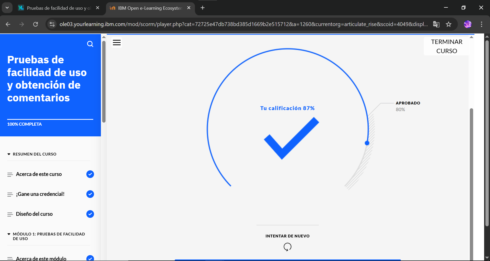

# Pruebas de facilidad de uso y obtención de comentarios

En este curso, aprenderá cómo los diseñadores de UX evalúan sus diseños mediante pruebas de facilidad de uso. Identificará los distintos métodos para llevar a cabo estas pruebas y comprenderá los pasos del proceso para realizarlas de manera efectiva. Además, aprenderá cómo los diseñadores priorizan la información obtenida de las pruebas de facilidad de uso y cómo estos comentarios contribuyen a la mejora de los diseños mediante la creación de un prototipo revisado. Finalmente, analizará un ejemplo de caso práctico de diseño de UX que presenta un plan de pruebas, herramientas para pruebas de facilidad de uso, un informe de análisis y un prototipo revisado para un sitio web de comercio electrónico de venta de plantas.

## Objetivos del curso

Después de completar este curso, debería ser capaz de:

- Explicar la importancia, los objetivos y los principales elementos de las pruebas de facilidad de uso.
- Diferenciar entre pruebas de facilidad de uso cualitativas y cuantitativas.
- Describir los distintos métodos cualitativos y cuantitativos para realizar pruebas de facilidad de uso.
- Explicar el proceso completo de pruebas de facilidad de uso.
- Describir el concepto de evaluación heurística en el contexto de pruebas de facilidad de uso.
- Identificar herramientas comunes para llevar a cabo pruebas de facilidad de uso.
- Explicar los diferentes niveles de gravedad y cómo usar la matriz de impacto-esfuerzo para priorizar los problemas detectados.
- Describir el proceso de recabar e incorporar comentarios sobre facilidad de uso para ultimar los diseños de UX.
- Revisar un ejemplo de caso práctico de diseño de UX para comprender cómo crear un plan de pruebas de facilidad de uso, cómo analizar los comentarios y documentarlos en un informe, y cómo revisar un prototipo en base a los resultados obtenidos.

## Evidencias del Módulo Completo

