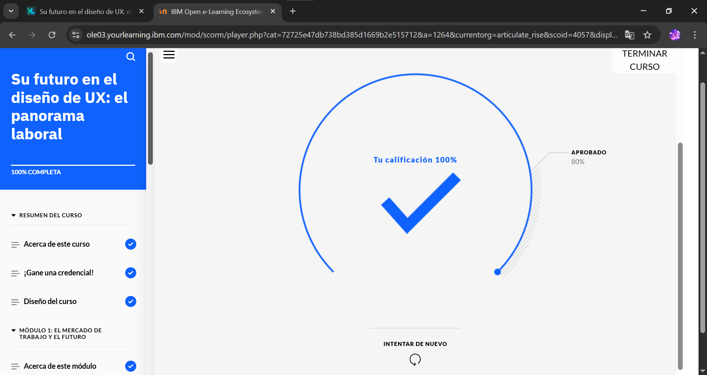

# Su futuro en el diseño de UX: el panorama laboral

En el actual mundo digital, las empresas reconocen la importancia de la experiencia del usuario (UX) para atraer y retener clientes. Por eso buscan profesionales que posean los conocimientos necesarios para crear experiencias de usuario intuitivas y atractivas. En consecuencia, la demanda de diseñadores de UX cualificados es cada vez mayor.

Le damos la bienvenida al curso **Su futuro en el diseño de UX: el panorama laboral**. En este curso, aprenderá sobre el mercado laboral del diseño de UX, las competencias que necesitan los diseñadores de UX para tener éxito y las responsabilidades de los diseñadores de UX. También descubrirá en qué se diferencian los diseñadores de UX del resto de diseñadores. Además, encontrará recursos y oportunidades de aprendizaje para poder explorar más.

## Objetivos del curso

Después de completar este curso, debería ser capaz de:

- Identificar los sectores en los que trabajan los diseñadores de UX.
- Conocer la demanda global de diseñadores de UX en el mercado laboral.
- Conocer el futuro del campo del diseño de UX.
- Identificar roles comunes en el campo del diseño de UX.
- Explicar las principales responsabilidades de un diseñador de UX.
- Identificar las competencias que necesitan los diseñadores de UX.
- Identificar recursos para aprender más y estar siempre al día en el campo del diseño de UX.

## Evidencias del Módulo Completo

