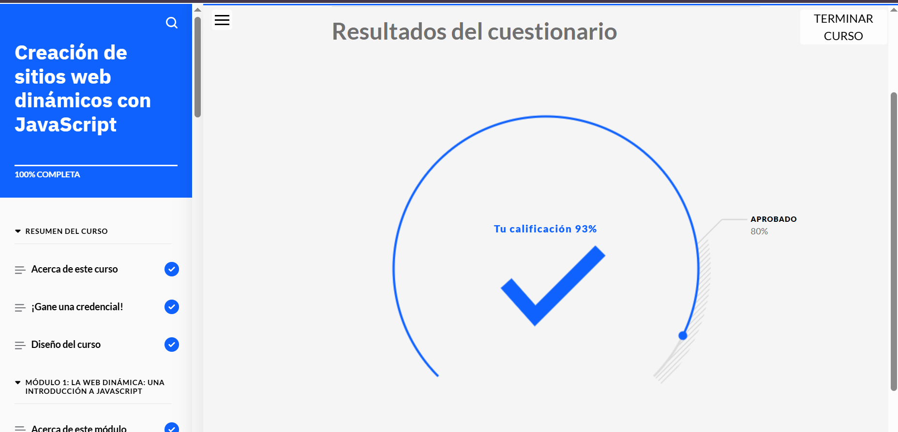

# Curso: JavaScript, Datos y Desarrollo Web Dinámico

En este curso, conocerá cómo los desarrolladores web utilizan **JavaScript con HTML** para crear sitios web dinámicos. Examinará la **sintaxis JavaScript** y el funcionamiento de las **variables**, las **funciones**, las **expresiones** y los **sucesos** en el código JavaScript.  
Explorará cómo los desarrolladores web **utilizan los datos** en los sitios web y el **código MySQL** para trabajar con los datos. También conocerá **Node.js** y las ventajas de utilizar **marcos** y **bibliotecas**.

---

## Requisitos previos

Antes de empezar este curso, deberá tener conocimientos sobre:

- Las funciones básicas de un sistema y las capas de la arquitectura del sistema  
- La estructura de **HTML**, **CSS** y **JavaScript**

Puede adquirir estos conocimientos completando los cursos:

- *Aspectos básicos del desarrollo web*  
- *Desarrollo de sitios para la web*  
  *(del plan de aprendizaje "Fundamentos del desarrollo web")*

---

## Objetivos del curso

Después de completar este curso, debería ser capaz de:

- Explicar la **sintaxis de JavaScript**
- Identificar las técnicas que los desarrolladores web utilizan para **incluir JavaScript en HTML**
- Comparar y contrastar distintos **modelos de programación**
- Explicar cómo utilizar **objetos de código**
- Explicar el funcionamiento de las **variables**, **funciones**, **expresiones**, **operadores** y **sucesos** en el código JavaScript para sitios web dinámicos
- Definir los **tipos de datos más comunes**
- Identificar las **cuatro funciones principales de base de datos**
- Reconocer una **sintaxis MySQL simple** para crear una base de datos y trabajar con los datos
- Explicar la finalidad y la función de **Node.js**

## Pantallazos Módulo Completo

