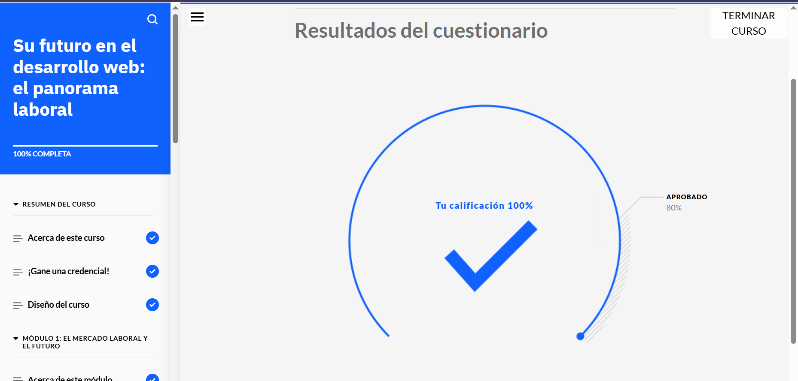

# Su futuro en el desarrollo web: el panorama laboral

Las empresas entienden la necesidad de tener un sitio web para comercializar sus productos e interactuar con los clientes. Como resultado, la demanda de desarrolladores web es cada vez mayor. Las empresas necesitan personas con competencias técnicas y laborales para diseñar, desarrollar y publicar sitios y aplicaciones para la web.

¡Bienvenido al curso **Su futuro en el desarrollo web: el panorama laboral**! En este curso, aprenderá sobre el mercado laboral del desarrollo web, las competencias que los desarrolladores web necesitan para tener éxito y cómo los desarrolladores web interactúan con otros roles profesionales de un equipo. También encontrará recursos y oportunidades de aprendizaje para que pueda seguir explorando.

## Objetivos del curso

Después de completar este curso, debería ser capaz de:

- Identificar los sectores en los que trabajan los desarrolladores web
- Reconocer la demanda global de profesionales del desarrollo web en el mercado laboral
- Reconocer el futuro del campo del desarrollo web
- Identificar los roles y las especialidades más comunes en el campo del desarrollo web
- Explicar las responsabilidades principales de los distintos roles del desarrollo web
- Identificar las competencias que necesitan los desarrolladores web
- Distinguir entre los distintos roles de un equipo de desarrollo web
- Identificar recursos para aprender más y estar siempre al día en el campo del desarrollo web

