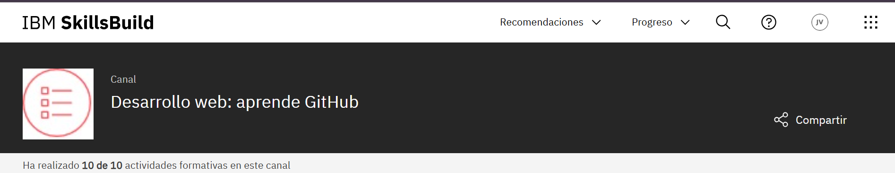
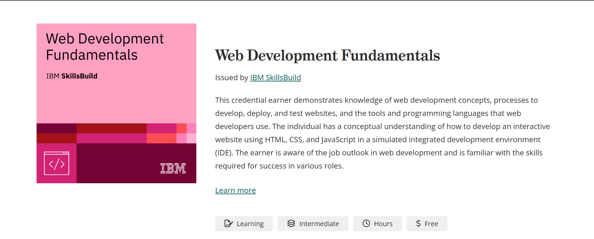

# Fundamentos del desarrollo web (¡Gane una credencial!)

## Acerca de este plan de formación

¿Desea tener la oportunidad de expresarse creativamente en Internet? El desarrollo web es un campo tecnológico apasionante y en crecimiento. Aprenda los conceptos básicos de los lenguajes, las herramientas y los procesos necesarios para el desarrollo de sitios web. A continuación, adquiera experiencia práctica creando una página web de lista de tareas interactiva en una serie de simulaciones. Por último, reciba consejos y conozca recursos que pueden ayudarle a comenzar una gran carrera en el desarrollo web.

Complete los siguientes cursos obligatorios para obtener una credencial digital de IBM SkillsBuild reconocida por el sector denominada **Fundamentos del desarrollo web**:

- Aspectos básicos del desarrollo web  
- Desarrollo de sitios para la web  
- Introducción a HTML y CSS 
- Creación de sitios web dinámicos con JavaScript
- Prueba y despliegue de sitios web  
- Desarrollar una página web de lista de tareas interactiva  
- Su futuro en el desarrollo web: el panorama laboral  

## Lo que aprenderá

Después de completar **Fundamentos del desarrollo web**, debería ser capaz de: 

- Identificar las funciones informáticas básicas, los tipos de lenguajes de programación, los pasos principales para desarrollar un sitio web y los fundamentos del desarrollo front-end y back-end.
- Explicar las características y funciones de HTML, CSS y JavaScript y cómo interactúan los lenguajes.
- Identificar las fases del ciclo de vida de desarrollo de software, así como el enfoque en cascada y el enfoque ágil del desarrollo web.
- Identificar los elementos HTML más comunes, los atributos HTML, las técnicas de la organización de codificación, el modelo de cuadro CSS y las buenas prácticas para escribir HTML y CSS, así como las principales características de un entorno de desarrollo integrado (IDE).
- Identificar la estructura básica del código JavaScript, las técnicas para incluir JavaScript en HTML y cómo JavaScript habilita sitios web dinámicos, así como las funciones de base de datos más populares donde almacenar y trabajar con los datos de los sitios web usando MySQL.
- Identificar los distintos tipos de pruebas de sitios web, el valor de las pruebas automatizadas, los sistemas de control de versiones, los pasos principales para publicar un sitio web, la entrega continua y el despliegue continuo, DevOps, el diseño reactivo, la computación en la nube para el desarrollo y despliegue web, y los métodos y las herramientas utilizados para probar y automatizar el despliegue de sitios web.
- Desarrollar una página web interactiva utilizando HTML, CSS y JavaScript, y realizar una prueba funcional simple en una página web.
- Reconocer el mercado laboral, las responsabilidades y los conjuntos de competencias de un profesional del desarrollo web, así como los recursos y las oportunidades de aprendizaje a explorar.

Los conocimientos y las habilidades de estos cursos se basan unos en otros, por lo que SkillsBuild recomienda completar los cursos en el orden en que se presentan.

